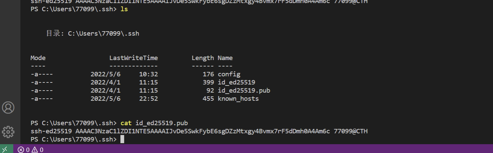
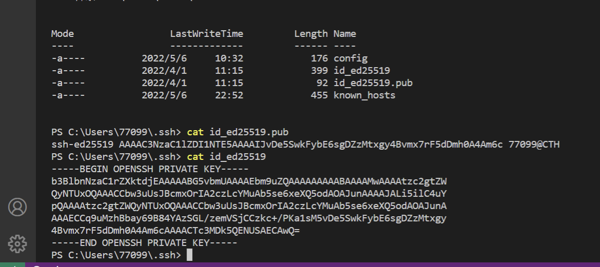
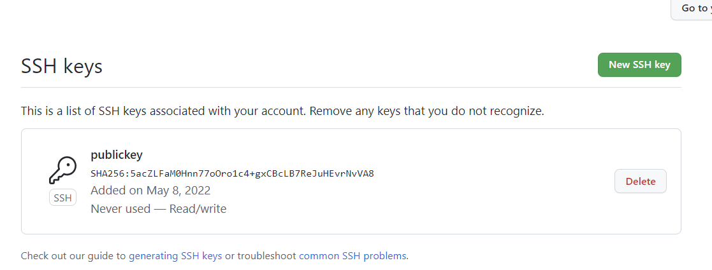
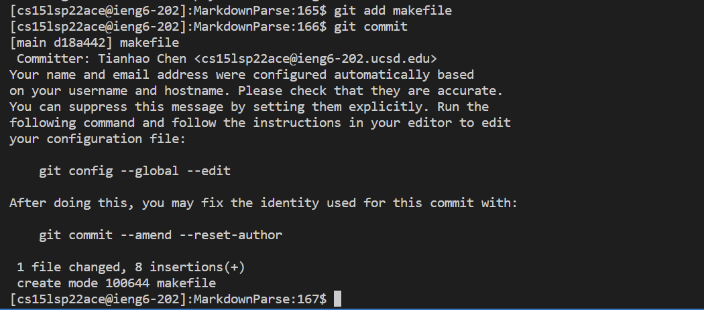
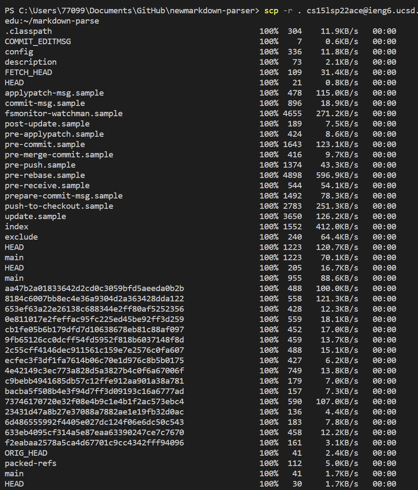
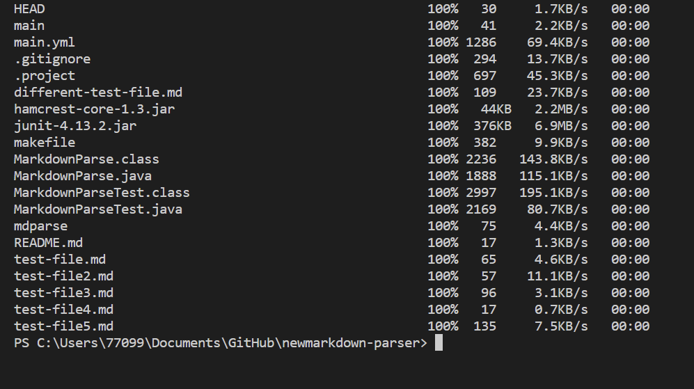
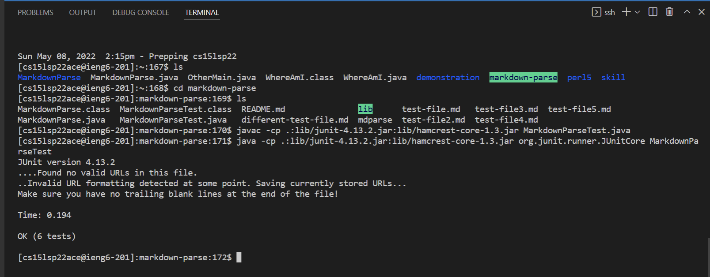
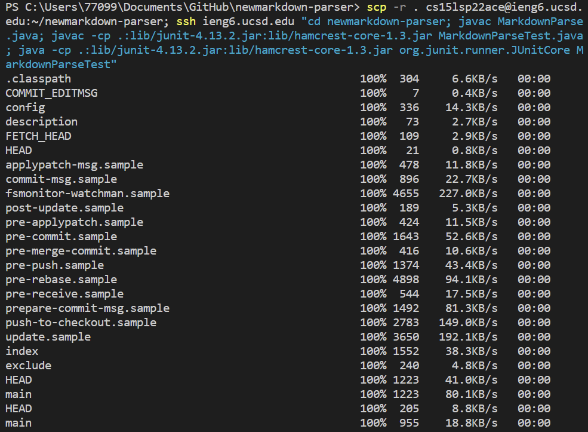
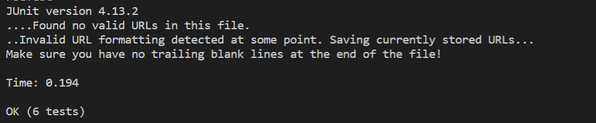

# CSE 15L Lab 2 

> __Name__ : Tianhao Chen  

> __Email__ : tic001@ucsd.edu 

## Streamlining ssh Configuration
I accessed my `.ssh/config` file by using:
```
% cd ~ .\ssh
% cat config
```
Here is the screenshot for the **.ssh/config** file and I edited its name after host into **ieng6.ucsd.edu** :


Next is the **ssh** command I used to log in with my alias:


Here is the screenshot for copying my markdownparse.java to my remote account by using **scp**:


## Setup Github Access from ieng6

### Public key on my user account is stored in id_ed25519.pub file in .ssh directory, while private key is stored in id_ed25519 file.

There is a screenshot of public key content:

Here is the private key content:

Here is the screenshot of where to store my public key on Github:


I modified **my MarkdownParseTest.java** file and create **makefile**.
I first used git add and then git commit to commit my change:


The link for git commit: [link](https://github.com/Cthloveross/newmarkdown-parser/commit/9cf2eabaa2578a5ca4d67701c9cc4342fff94096)

## Copy whole directories with **scp -r**
### Copy the whole markdownparse to ieng6 account.
- We can use `scp` to copy the markdown-parse to the remote server.
```
scp -r . cs15lsp22(Your own username)@ieng6.ucsd.edu:~/markdown-parse
```




### Compile and run tests on ieng6

- We can use the command below to run the test on the remote access.
```
javac -cp .:lib/junit-4.13.2.jar:lib/hamcrest-core-1.3.jar MarkdownParseTest.java
java -cp .:lib/junit-4.13.2.jar:lib/hamcrest-core-1.3.jar org.junit.runner.JUnitCore MarkdownParseTest
```


### Do the process in one line
Here is the code for me to run in one line:
```
scp -r . cs15lsp22ace@ieng6.ucsd.edu:~/newmarkdown-parser; ssh ieng6.ucsd.edu "cd newmarkdown-parser; javac MarkdownParse.java; javac -cp .:lib/junit-4.13.2.jar:lib/hamcrest-core-1.3.jar MarkdownParseTest.java; java -cp .:lib/junit-4.13.2.jar:lib/hamcrest-core-1.3.jar org.junit.runner.JUnitCore MarkdownParseTest"
```
Here is the screenshot for one line code.

