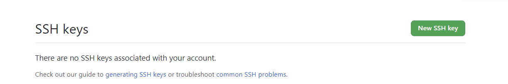

# CSE 15L Lab 2 

> __Name__ : Tianhao Chen  

> __Email__ : tic001@ucsd.edu 

## Streamlining ssh Configuration
I accessed my `.ssh/config` file by using:
```
% cd ~ .\ssh
% cat config
```
Here is the screenshot for the **.ssh/config** file and I edited its name after host into **ieng6.ucsd.edu** :


Next is the **ssh** command I used to log in with my alias:


Here is the screenshot for copying my markdownparse.java to my remote account by using **scp**:


## Setup Github Access from ieng6

### Public key on my user account is stored in id_ed25519.pub file in .ssh directory, while private key is stored in id_ed25519 file.

There is a screenshot of public key content:

Here is the private key content:

Here is the screenshot of where to store my public key on Github:


I modified **my MarkdownParseTest.java** file and create **makefile**.
I first used git add and then git commit to commit my change:


## Copy whole directories with **scp -r**


